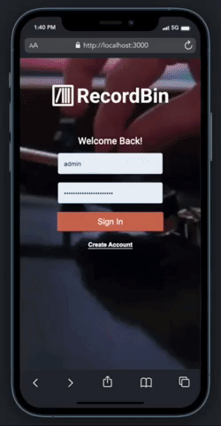

# RecordBin

## Description
_Duration: 2 Week Sprint_

As an avid record collector- I identified a need for the ability to access your record collection on the go, or just without flipping through your collection manually. I created a fully functional, full-stack CRUD web application RecordBin, to catalog and manage your vinyl collection using Discogs API. The user is able to browse records by search or barcode scanner, save to wishlist and add to their personal collection.

## Demo

 
To see the fully functional site, click [here](https://desolate-spire-23251.herokuapp.com/#/).

 
The app does take around 30 seconds to load.  

## Built With

-React.js
-MaterialUI
-React-Redux
 
-React-Sagas
-CSS
-Node.js
 
-postgreSQL
-Passport
 
-react-qr-barcode-scanner 
-react-scroll-to-top
 

## Acknowledgement
Thanks to [Prime Digital Academy](www.primeacademy.io) who equipped and helped me to make this application a reality. Huge thanks to my peers in the Gaiman cohort for their unwavering support- I couldn't have done it without them. Hugs and love to my friends and family for being patient with me while I immersed myself in the software world and had little time for anything else. 

## Support
If you have suggestions or issues, please email me at jmbranstrator@gmail.com
